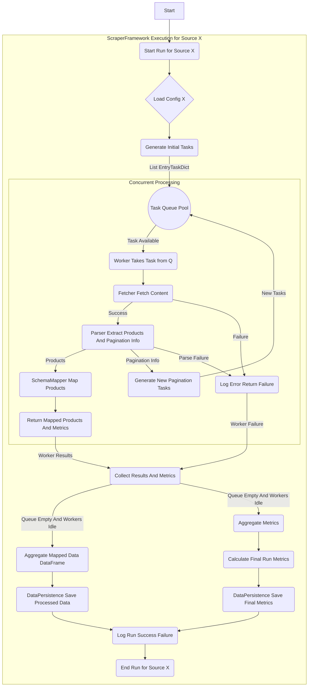

```mermaid
graph TD
    subgraph ScraperFramework Execution for Source X
        direction LR

        A(Start Run for Source X) --> B{Load Config X};
        B --> C(Generate Initial Tasks);
        C -- List EntryTaskDict --> Q((Task Queue Pool));

        subgraph Concurrent Processing
             direction TB
             W(Worker Takes Task from Q) --> F1(Fetcher Fetch Content);
             F1 -- Success --> P1(Parser Extract Products And Pagination Info);
             P1 -- Products --> M1(SchemaMapper Map Products);
             M1 --> R1(Return Mapped Products And Metrics);
             P1 -- Pagination Info --> NT(Generate New Pagination Tasks);
             NT -- New Tasks --> Q; 
             F1 -- Failure --> R2(Log Error Return Failure);
             P1 -- Parse Failure --> R2;
         end

        Q -- Task Available --> W;
        R1 -- Worker Results --> AGG(Collect Results And Metrics);
        R2 -- Worker Failure --> AGG;

        AGG -- Queue Empty And Workers Idle --> F(Aggregate Mapped Data DataFrame);
        AGG -- Queue Empty And Workers Idle --> G(Aggregate Metrics);
        G --> H(Calculate Final Run Metrics);
        F --> I(DataPersistence Save Processed Data);
        H --> J(DataPersistence Save Final Metrics);
        I --> K(Log Run Success Failure);
        J --> K;
        K --> Z(End Run for Source X);

    end

    Start --> A;
```