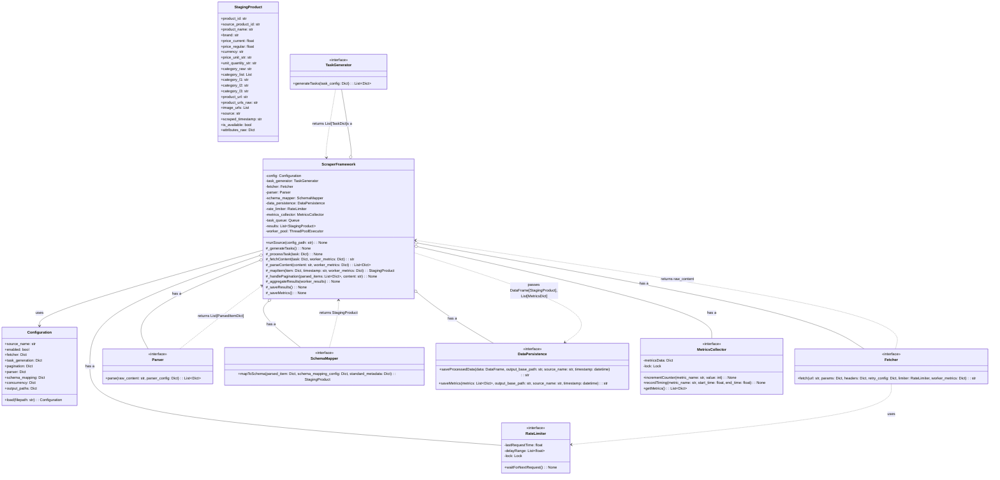

# Scalable Scraper System Architecture

## Core Principles

1.  **Modularity:** Break down the scraping process into distinct, reusable stages.
2.  **Abstraction:** Define common interfaces for components that perform similar tasks (e.g., fetching, parsing).
3.  **Configuration Driven:** Store source-specific details (URLs, selectors, parameters, data mappings) externally (e.g., YAML files, database) instead of hardcoding them.
4.  **Separation of Concerns:** Isolate fetching logic, parsing logic, data transformation, and persistence logic.
5.  **Standardized Output Schema:** Define a target "canonical" data schema for your products. Each source's data will be mapped to this schema during processing.
6.  **Extensibility:** Make it easy to add a new source by adding configuration and a source-specific module, without modifying the core framework extensively.

## Class Diagram


---

## Filesystem overview

## Scalable Scraper System: Filesystem Organization

This document proposes a standard filesystem structure for the Scalable Scraper System project. This organization aims for clarity, maintainability, and adherence to common Python project conventions, incorporating the specified output structure.

```plaintext
scalable-scraper/
├── .gitignore                  # Specifies intentionally untracked files git should ignore
├── main.py                     # Main entry point script to run the scraper framework
├── pyproject.toml              # OR requirements.txt - Project metadata and dependencies
├── README.md                   # Project overview, setup, and usage instructions
│
├── configs/                    # Directory for source-specific configuration files
│   ├── example_source.yaml     # Configuration for 'example_source'
│   ├── continente.yaml         # Configuration for 'continente'
│   └── ...                     # Other source configuration files
│
├── data/                       # Root directory for generated data (SHOULD BE IN .gitignore)
│   ├── input/                  # Optional: Input files for task generation (e.g., CSVs)
│   │   └── categories.csv      # Example input CSV
│   │
│   ├── processed/              # Default base location for processed Parquet output
│   │   ├── auchan/             # Subdirectory named after the source_name
│   │   │   └── auchan_products_YYYYMMDD.parquet # Filename pattern
│   │   ├── continente/
│   │   │   └── continente_products_YYYYMMDD.parquet
│   │   └── ...                 # Other source directories...
│   │
│   └── metrics/                # Default base location for metrics JSON output
│       ├── auchan/             # Subdirectory named after the source_name
│       │   └── auchan_metrics_YYYYMMDD.json # Filename pattern
│       ├── continente/
│       │   └── continente_metrics_YYYYMMDD.json
│       └── ...                 # Other source directories...
│
├── logs/                       # Directory for runtime log files (SHOULD BE IN .gitignore)
│   ├── auchan/                 # Subdirectory named after the source_name
│   │   └── auchan_pipeline_YYYYMMDD_HHMMSS.log # Filename pattern (granular timestamp recommended)
│   ├── continente/
│   │   └── continente_pipeline_YYYYMMDD_HHMMSS.log
│   └── ...                     # Other source directories...
│
├── src/                        # Main source code directory
│   └── scraper/                # The core scraper package
│       ├── __init__.py         # Makes 'scraper' a Python package
│       │
│       ├── components/         # Sub-package for individual, reusable components
│       │   ├── __init__.py
│       │   ├── fetcher.py      # Contains Fetcher interface and implementations
│       │   ├── generator.py    # Contains TaskGenerator interface and implementations
│       │   ├── limiter.py      # Contains RateLimiter implementation(s)
│       │   ├── mapper.py       # Contains SchemaMapper interface and implementation(s)
│       │   ├── parser.py       # Contains Parser interface and implementations
│       │   └── persistence.py  # Contains DataPersistence interface and implementation(s)
│       │
│       ├── config_loader.py    # Utility for loading YAML configs
│       ├── exceptions.py       # Custom exception classes (if any)
│       ├── framework.py        # The main ScraperFramework orchestrator class
│       ├── models.py           # Contains data models (e.g., StagingProduct Pydantic model)
│       └── utils.py            # Common utility functions
│
├── tests/                      # Directory for automated tests
│   ├── __init__.py
│   │
│   ├── components/             # Tests specifically for components
│   │   ├── __init__.py
│   │   └── ...                 # (test_fetcher.py, test_parser.py, etc.)
│   │
│   ├── fixtures/               # Optional: Test data, sample HTML/JSON files
│   │   └── sample_page.html
│   │
│   ├── test_framework.py       # Integration or unit tests for the framework orchestrator
│   └── test_models.py          # Tests for data models
│
└── venv/                       # Virtual environment directory (SHOULD BE IN .gitignore)
    └── ...                     # (Contents managed by Python's venv)
```

## Scalable Scraper System: Implementation Specifications

**Version:** 1.1
**Date:** YYYY-MM-DD

**Purpose:** This document provides concrete implementation details, library choices, and logic specifications for the core components outlined in the initial design documents (Configuration Schema, Canonical Schema, Class Diagram, Interfaces). It incorporates the decisions made based on the user feedback, aiming to minimize ambiguity for development.

---

### 1. `StagingProduct` Data Model

The canonical output structure will be represented using a Pydantic model for type validation and clarity.

```python
# Example using Pydantic
from typing import List, Optional, Dict, Any
from pydantic import BaseModel, Field, HttpUrl, validator
from datetime import datetime

class StagingProduct(BaseModel):
    product_id: str = Field(..., description="Unique identifier for the product within the source context.")
    source_product_id: str = Field(..., description="The original product ID/SKU from the source.")
    product_name: str = Field(..., description="Product name/title.")
    brand: Optional[str] = Field(None, description="Brand name, as extracted.")
    price_current: Optional[float] = Field(None, description="Current selling price.")
    price_regular: Optional[float] = Field(None, description="Regular/original price.")
    currency: str = Field(..., description="ISO 4217 currency code.", pattern="^[A-Z]{3}$")
    price_unit_str: Optional[str] = Field(None, description="Raw string representing price per unit.")
    unit_quantity_str: Optional[str] = Field(None, description="Raw string representing the quantity/size.")
    category_raw: Optional[str] = Field(None, description="Original, unparsed category representation.")
    category_list: Optional[List[str]] = Field(None, description="List of categories if parsed directly.")
    category_l1: Optional[str] = Field(None, description="Directly parsed L1 category.")
    category_l2: Optional[str] = Field(None, description="Directly parsed L2 category.")
    category_l3: Optional[str] = Field(None, description="Directly parsed L3 category.")
    product_url: HttpUrl = Field(..., description="Absolute URL to the main product page.")
    product_urls_raw: Optional[str] = Field(None, description="Raw string of related URLs if found.")
    image_urls: Optional[List[HttpUrl]] = Field(default_factory=list, description="List of absolute image URLs.")
    source: str = Field(..., description="Unique identifier for the data source.")
    scraped_timestamp: datetime = Field(..., description="UTC timestamp of scraping.")
    is_available: Optional[bool] = Field(None, description="Availability status, if extractable.")
    attributes_raw: Optional[Dict[str, Any]] = Field(default_factory=dict, description="Catch-all for extra attributes.")

    # Example validator if needed downstream, but not strictly for staging
    # @validator('scraped_timestamp', pre=True, always=True)
    # def format_timestamp(cls, v):
    #     if isinstance(v, str):
    #         return datetime.fromisoformat(v.replace('Z', '+00:00'))
    #     return v

    class Config:
        extra = 'forbid' # Ensure no extra fields are added accidentally
```

---

### 2. `TaskGenerator` Interface & Implementations

**Interface Change:** The `TaskGenerator` will now function as a Python generator, yielding individual page tasks (including pagination) rather than returning a complete list upfront.

```python
from typing import Dict, Any, Generator, Tuple

class TaskGenerator:
    """Interface for generating scraping tasks for a source."""

    def generateTasks(self, task_config: Dict[str, Any], fetcher_config: Dict[str, Any], pagination_config: Dict[str, Any]) -> Generator[Dict[str, Any], None, None]:
        """
        Yields individual task dictionaries, handling pagination internally.

        Args:
            task_config: The 'task_generation' section from the config.
            fetcher_config: The 'fetcher' section (needed for base_url, headers).
            pagination_config: The 'pagination' section (defines how to get next pages).

        Yields:
            Dict[str, Any]: A dictionary representing a single page task.
                            Must contain at least {'url': str}.
                            May contain {'metadata': Dict} for context.
        """
        raise NotImplementedError
```

**Implementations:**

*   **`StaticUrlTaskGenerator`:**
    *   **Input:** Reads `task_generation.urls` (list of starting URLs) from config. Can optionally read unique values from a specified CSV file column if configured.
    *   **Libraries:** `csv` or `pandas` (if reading from CSV).
    *   **Logic:**
        1.  Iterate through each starting URL provided (from `urls` list or CSV column).
        2.  For each starting URL, yield the initial task: `{'url': initial_url_with_params, 'metadata': {'start_url': url}}`. Apply `task_generation.static_params`.
        3.  **Pagination Handling:** Implement the simpler approach: Only handle `param_increment` pagination *within* the generator *if* termination conditions (`total_count_selector` or a hardcoded max page limit) are feasible without fetching. Yield subsequent page tasks `{'url': next_page_url_with_params, 'metadata': {'start_url': url}}`. Otherwise (e.g., for `next_page_selector` or if `param_increment` needs dynamic discovery), yield only the first page task. The framework's worker loop will handle discovering and queueing subsequent pages for these cases.

*   **`CategoryListTaskGenerator`:**
    *   **Input:** Reads `task_generation.category_base_url`, `category_param`, `category_values`. Can optionally read unique `category_values` from a specified CSV file column.
    *   **Libraries:** `csv` or `pandas` (if reading from CSV).
    *   **Logic:** Similar to `StaticUrlTaskGenerator`:
        1.  Iterate through each `category_value`.
        2.  Construct the initial URL using `category_base_url`, `category_param`, the current `category_value`, and `static_params`.
        3.  Yield the initial task `{'url': initial_category_url, 'metadata': {'category': category_value}}`.
        4.  Handle pagination internally based on `param_increment` (if feasible) or defer other pagination types to the framework by yielding only the first page.

*   **`SitemapXmlTaskGenerator`:**
    *   **Status:** **Deferred Implementation.**
    *   **Placeholder:** Create a dummy class that yields nothing or logs a "Not Implemented" message.
    *   **Future Libraries:** `requests`, `lxml`.
    *   **Future Logic:** Fetch `sitemap_url`, parse XML (handling nested sitemaps/indexes), apply `sitemap_filter_pattern`, yield tasks `{'url': product_url}`. Pagination is typically not needed here as product URLs are listed directly.

---

### 3. `Fetcher` Implementation

*   **Class:** `RequestsFetcher`
*   **Library:** `requests`
*   **Interface:**
    ```python
    from typing import Dict, Optional, Tuple
    # Assuming RateLimiter is defined elsewhere
    # from .rate_limiter import RateLimiter

    class Fetcher:
        def fetch(self, url: str, params: Optional[Dict], headers: Dict, retry_config: Dict, limiter: 'RateLimiter', worker_metrics: Dict) -> str:
            """Fetches raw content, handles retries and rate limiting."""
            raise NotImplementedError
    ```
*   **Retry Logic:**
    *   Implement using a wrapper function/decorator around the core `requests.get` call.
    *   The wrapper will use a loop, `time.sleep`, and track attempts based on `retry_config['retries']` and `retry_config['delay']`.
    *   Retry on connection errors, timeouts, and potentially configurable HTTP status codes (e.g., 5xx).
*   **Error Handling:**
    *   If all retries fail, raise the underlying standard `requests.exceptions.RequestException` (or a relevant subclass like `requests.exceptions.Timeout`, `requests.exceptions.ConnectionError`). No custom `FetchError` needed.
*   **Rate Limiting:** Call `limiter.waitForNextRequest()` *before* each fetch attempt (including retries).
*   **Metrics:** Increment `worker_metrics['fetch_attempts']` on each attempt, `worker_metrics['fetch_success']` on success, `worker_metrics['fetch_errors']` on final failure.

---

### 4. `Parser` Implementation

*   **Class:** `HtmlCssParser`
*   **Library:** `BeautifulSoup4` (`bs4`)
*   **Interface Change:** `parse` method MUST now return pagination information alongside extracted items.
    ```python
    from typing import Dict, List, Optional, Tuple, Any

    class Parser:
        def parse(self, raw_content: str, parser_config: Dict, pagination_config: Dict) -> Tuple[List[Dict[str, Any]], Optional[str]]:
            """
            Parses raw content to extract product data and next page URL.

            Args:
                raw_content: HTML source string.
                parser_config: The 'parser' section from config.
                pagination_config: The 'pagination' section (needed to find next page selector).

            Returns:
                Tuple containing:
                - List[Dict[str, Any]]: List of extracted items (intermediate fields).
                - Optional[str]: The URL of the next page, if found based on
                                 pagination_config (e.g., href from 'next_page_selector').
                                 Returns None if no next page is found or applicable.
            """
            raise NotImplementedError
    ```
*   **Extraction Logic (`parser.fields`):**
    *   Iterate through elements matching `parser_config['product_container_selector']`.
    *   For each container, iterate through the `fields` definitions in `parser_config`.
    *   Use `container.select_one(field_config['selector'])` or `container.select(field_config['selector'])` (if `list: true`).
    *   **Extraction:**
        *   If `attribute` is specified, get `element[attribute]`. Handle potential `KeyError` gracefully (return `None`).
        *   Otherwise, get `element.get_text(strip=True)`.
    *   **Type Conversion:** **Minimal.** Return the extracted value largely as raw strings. No automatic `float`/`int` conversion or cleaning (like removing currency symbols) will be performed by the parser.
    *   **Mandatory Fields:** If `mandatory: true` and the selector finds no element OR the extracted value is empty/None after stripping, log a `WARNING` for that item/field and skip the *entire item*, adding to a `'skipped_items'` metric.
    *   **`list: true`:** Iterate through results of `container.select(...)` and extract text/attribute for each, returning a `List[str]`.
    *   **JSON Handling (`_source_selector`, `_parse_as: json`):**
        *   If configured, find the source element/attribute.
        *   Use `json.loads()` to parse the content.
        *   **Simplified V1:** Return the *entire parsed JSON object/list* as the value for this intermediate field. Do **not** implement `path` or `_subfields` traversal within the parser. Handle `json.JSONDecodeError` by logging a warning and returning `None` for the field.
*   **Pagination Info Extraction:**
    *   After parsing items, check `pagination_config['type']`.
    *   If `type` is `"next_page_selector"`, use `bs4_object.select_one(pagination_config['next_page_selector'])`.
    *   If the selector finds an element and it's an `<a>` tag with an `href` attribute:
        *   Extract the `href` value.
        *   Attempt to make it absolute using `urllib.parse.urljoin(base_url, href)` (requires the base URL of the current page, which might need to be passed to `parse` or inferred).
        *   Return the absolute URL as the second element of the tuple.
    *   Handle potential `KeyError` if `href` is missing or selector doesn't find element.
    *   Return `None` as the second element if the selector is not found, or pagination type is not `next_page_selector`.
*   **Metrics:** Update `worker_metrics` with counts like `'items_extracted'`, `'items_skipped'`, `'parse_errors'`.

---

### 5. `SchemaMapper` Implementation

*   **Class:** `DictSchemaMapper`
*   **Interface:**
    ```python
    from typing import Dict, Any
    # from .models import StagingProduct # Assuming pydantic model is defined

    class SchemaMapper:
        def mapToSchema(self, parsed_item: Dict[str, Any], schema_mapping_config: Dict[str, Any], standard_metadata: Dict[str, Any]) -> 'StagingProduct':
            """Maps parsed intermediate data to the canonical StagingProduct model."""
            raise NotImplementedError
    ```
*   **Mapping Logic (`schema_mapping`):**
    *   Initialize an empty dictionary `canonical_data`. Add `standard_metadata` (`source`, `scraped_timestamp`).
    *   Iterate through `schema_mapping_config.items()`, where `key` is the `canonical_field_name` and `value` is the mapping rule.
    *   **Rule Processing (for `value`):**
        *   **Literal String:** If `value` is a string starting and ending with double quotes (`"`) *and* has length >= 2, strip the quotes and assign the inner string directly to `canonical_data[key]`.
        *   **Literal Number (from YAML):** If `value` is loaded by the YAML parser as an `int` or `float`, assign it directly. (YAML handles number detection).
        *   **List Creation:** If `value` is a string matching the pattern `'[some_intermediate_field]'`, extract `some_intermediate_field`. Look up its value in `parsed_item`. If found and not `None`, assign `[value_found]` to `canonical_data[key]`. If not found or `None`, assign `[]`. This handles only single intermediate field to single-element list conversion.
        *   **Nested Dictionary (`attributes_raw`):** If `value` is a dictionary loaded from YAML (e.g., for `attributes_raw`), iterate through its items (`sub_key: sub_value_rule`). Recursively apply these same rule processing steps to `sub_value_rule` to get the value from `parsed_item`, and build the nested dictionary assigned to `canonical_data[key]`.
        *   **Dot Notation / Intermediate Field Name:** Otherwise (if it's not a literal string, number, list syntax, or nested dict), treat `value` (which must be a string) as an intermediate field name, potentially using dot notation. Implement a helper function `get_nested_value(data_dict, key_string)` that splits `key_string` by `.` and traverses `data_dict` using `dict.get()` sequentially. Handle `AttributeError` if attempting dot notation on non-dict elements. Return `None` if any part of the path doesn't exist. Assign the result to `canonical_data[key]`.
*   **Output:** Instantiate the `StagingProduct` Pydantic model using `StagingProduct(**canonical_data)`. Pydantic will perform basic type validation (e.g., ensuring `product_url` is a valid URL format, `scraped_timestamp` is datetime). Handle `pydantic.ValidationError` by logging an `ERROR` including `e.errors()` and returning `None` for this item (preventing it from being saved).
*   **Metrics:** Update `worker_metrics` with counts like `'items_mapped'`, `'mapping_validation_errors'`.

---

### 6. `DataPersistence` Implementation

*   **Class:** `LocalFileSystemPersistence`
*   **Libraries:** `pandas`, `pyarrow`, `json`, `os`, `datetime`
*   **Interface:**
    ```python
    import pandas as pd
    from typing import List, Dict, Any
    from datetime import datetime

    class DataPersistence:
        def saveProcessedData(self, data: pd.DataFrame, output_base_path: str, source_name: str, timestamp: datetime) -> str:
            """Saves processed data DataFrame to Parquet."""
            raise NotImplementedError

        def saveMetrics(self, metrics: List[Dict[str, Any]], output_base_path: str, source_name: str, timestamp: datetime) -> str:
            """Saves run metrics to JSON."""
            raise NotImplementedError
    ```
*   **`saveProcessedData` Logic:**
    1.  Format timestamp: `run_date_str = timestamp.strftime('%Y%m%d')`.
    2.  Construct filename: `filepath = os.path.join(output_base_path, f"{source_name}_{run_date_str}.parquet")`.
    3.  Ensure directory exists: `os.makedirs(output_base_path, exist_ok=True)`.
    4.  Save DataFrame: `data.to_parquet(filepath, engine='pyarrow', index=False, compression='snappy')`. (Added compression).
    5.  Return `filepath`. Catch and re-raise standard file I/O exceptions (`IOError`, `OSError`, `PermissionError`) and `pyarrow` specific errors.
*   **`saveMetrics` Logic:**
    1.  Format timestamp: `run_datetime_str = timestamp.strftime('%Y%m%d_%H%M%S')`.
    2.  Construct filename: `filepath = os.path.join(output_base_path, f"{source_name}_metrics_{run_datetime_str}.json")`.
    3.  Ensure directory exists: `os.makedirs(output_base_path, exist_ok=True)`.
    4.  Save metrics: Use `json.dump(metrics, f, indent=4)` within a `with open(filepath, 'w', encoding='utf-8') as f:`.
    5.  Return `filepath`. Catch and re-raise standard file I/O exceptions and `TypeError` if metrics aren't JSON serializable.

---

### 7. `RateLimiter` Implementation

*   **Class:** `ThreadSafeRateLimiter`
*   **Libraries:** `threading`, `time`, `random`
*   **Interface Implementation:**
    ```python
    import threading
    import time
    import random
    from typing import List

    class RateLimiter:
        def __init__(self, delay_range: List[float]):
            # Ensure min/max are correctly ordered and non-negative
            self._min_delay = max(0.0, min(delay_range))
            self._max_delay = max(self._min_delay, max(delay_range))
            self._last_request_time = 0.0
            self._lock = threading.Lock()

        def waitForNextRequest(self) -> None:
            """Blocks until the configured delay has passed since the last request across threads."""
            with self._lock:
                # Use monotonic clock for measuring intervals reliably
                now = time.monotonic()
                elapsed_since_last = now - self._last_request_time
                # Calculate the required delay for this specific call
                required_delay = random.uniform(self._min_delay, self._max_delay)
                # Calculate how much *more* time we need to wait
                wait_time = max(0, required_delay - elapsed_since_last)

                if wait_time > 0:
                    time.sleep(wait_time)

                # Update last request time *after* waiting, marking the end of the wait/start of request
                self._last_request_time = time.monotonic()
    ```

---

### 8. `MetricsCollector` Strategy

*   **Approach:** **Per-Thread Dictionaries.** No central `MetricsCollector` class or interface is needed.
*   **Implementation:**
    1.  The `ScraperFramework` worker thread function (e.g., `_processTask`) will initialize an empty dictionary `worker_metrics = {}` at the start of processing a task/page.
    2.  This `worker_metrics` dictionary will be passed as a mutable argument to the `fetch`, `parse`, and `mapToSchema` method calls executed within that worker for that task.
    3.  The implementations of `Fetcher`, `Parser`, and `SchemaMapper` (as documented above) will update relevant counters directly in the passed-in `worker_metrics` dictionary using `.get(key, 0) + 1` for safe incrementing. Example keys: `fetch_attempts`, `fetch_success`, `fetch_errors`, `items_extracted`, `items_skipped`, `parse_errors`, `items_mapped`, `mapping_validation_errors`.
    4.  The `_processTask` function in `ScraperFramework` will return this `worker_metrics` dictionary (along with the list of successfully mapped `StagingProduct` objects) when processing for that specific task/page is complete.
    5.  The main control flow of `ScraperFramework` (likely using `concurrent.futures`) will collect the results (including the `worker_metrics` dictionaries) from all completed tasks/pages.
    6.  After all tasks are processed and workers have finished, `ScraperFramework` will execute a dedicated private method (e.g., `_aggregate_run_metrics`). This method iterates through the collected list of all `worker_metrics` dictionaries. It sums up the corresponding counter values from each dictionary to produce a final, single list of metric dictionaries (e.g., `[{'metric_name': 'total_fetch_success', 'metric_value': 1234}, ...]`) representing the entire run. This final list is then passed to `DataPersistence.saveMetrics`.

---

# Pre-Implementation Planning & Documentation for Scalable Scraper System

This document outlines the necessary planning and documentation steps to undertake before starting the implementation of the scalable scraper system, based on the defined architecture. Completing these steps will ensure clarity, consistency, and reduce rework during development.

## 1. Define the Canonical Data Schema

*   **What:** The standard, unified structure and fields for the final product data that will be output by the system, regardless of the original source.
*   **Why:** This is the target for all source-specific parsing and mapping. A clear canonical schema ensures data consistency across all sources, simplifying downstream analysis, database loading, and application usage. It decouples the final data format from the idiosyncrasies of individual source websites.
*   **How:**
    *   **Create Documentation:** Start a dedicated document (e.g., `canonical_schema.md`, Wiki page).
    *   **List Fields:** Enumerate every field intended for the final output.
    *   **Specify Details per Field:** For each field, clearly define:
        *   **`Field Name`**: The standardized name (e.g., `product_id`, `name`, `brand`, `description`, `price_current`, `price_regular`, `currency`, `price_unit`, `unit_measure`, `unit_quantity`, `category_l1`, `category_l2`, `category_l3`, `product_url`, `image_urls` (list), `source`, `scraped_timestamp`, `is_available`, `attributes` (dict)).
        *   **`Data Type`**: The expected Python/Pandas/JSON type (e.g., `str`, `float`, `int`, `bool`, `list[str]`, `dict[str, str]`, `str (ISO 8601)` for timestamps).
        *   **`Mandatory/Optional`**: Specify if the field *must* have a value for every product (`Mandatory`) or if it can be `null`/`None` (`Optional`).
        *   **`Description/Rules`**: Provide a clear definition, including units, formatting rules, or examples (e.g., "`price_current`: Final selling price including tax, as float.", "`unit_measure`: Standardized unit, e.g., 'kg', 'l', 'unit', 'g', 'ml'.", "`image_urls`: List of full URLs for product images.", "`scraped_timestamp`: ISO 8601 format string (UTC preferred).").
    *   **(Optional but Recommended) Formal Schema Definition:**
        *   Define the schema using JSON Schema.
        *   Alternatively, create Python Dataclasses or Pydantic models representing the canonical product structure. This aids validation during the mapping stage.

## 2. Define the Configuration Schema

*   **What:** The detailed structure, keys, values, and data types allowed within the source configuration files (e.g., `config/source_name.yaml`).
*   **Why:** Provides a clear contract for adding/modifying source configurations. Allows the `ConfigurationStore` to load settings reliably and enables automated validation of configuration files. Ensures all necessary parameters for fetching, parsing, mapping, and concurrency are present.
*   **How:**
    *   **Create Template/Example:** Develop a comprehensive template file (e.g., `config_template.yaml`) that includes *all* possible sections and keys with comments explaining each one. Cover:
        *   Basic info: `source_name`, `enabled`
        *   Fetcher: `fetcher_type`, `base_url`, `request_headers`, `retry_config`, `politeness_delay`
        *   Task Generation: `task_generation.type`, `task_generation.categories`/`sitemap_url`/`api_params`
        *   Pagination: `pagination.type`, `pagination.param_name`/`selector`/`next_page_logic`, `pagination.page_size`
        *   Parser: `parser_config.product_container_selector`, `parser_config.fields` (detailing selector, attribute, type for each field)
        *   Mapping: `schema_mapping` (source_field: canonical_field)
        *   Concurrency: `concurrency.type`, `concurrency.num_threads`
        *   Output: `output_paths.processed`, `output_paths.metrics`, `output_paths.logs`
    *   **Specify Details:** Document the expected data type for each configuration value (`string`, `integer`, `float`, `list`, `dict`, `boolean`).
    *   **Define Mandatory/Optional:** Indicate which keys are required and which are optional. Specify default values for optional keys (e.g., `num_threads` defaults to 1).
    *   **(Optional but Recommended) Formal Schema Definition:** Use JSON Schema to create a formal definition of the configuration structure. This allows programmatic validation using libraries like `jsonschema`.

## 3. Detail Key Component Interfaces

*   **What:** Define the precise method signatures (function name, parameters with types, return types, potential exceptions raised) for the primary interactions *between* the major architectural components.
*   **Why:** Ensures components can be developed more independently and integrate smoothly. Removes ambiguity about data contracts between components. Makes the system easier to understand and test.
*   **How:**
    *   **Focus on Interactions:** Document the interfaces for key communication points identified in the class diagram:
        *   `ScraperFramework` -> `TaskGenerator`: e.g., `generateTasks(task_config: Dict) -> List[Dict]`
        *   `ScraperFramework` (Worker) -> `Fetcher`: e.g., `fetch(url: str, params: Optional[Dict], headers: Dict) -> str` (document expected `requests.RequestException`, `TimeoutError` etc.)
        *   `ScraperFramework` (Worker) -> `Parser`: e.g., `parse(raw_content: str, parser_config: Dict) -> List[Dict]`
        *   `ScraperFramework` (Worker) -> `SchemaMapper`: e.g., `mapToSchema(parsed_data: List[Dict], schema_config: Dict, metadata: Dict) -> List[Dict]`
        *   `ScraperFramework` -> `DataPersistence`: e.g., `saveProcessedData(data: pd.DataFrame, output_config: Dict, source_name: str, timestamp: datetime) -> str`, `saveMetrics(metrics: List[Dict], output_config: Dict, source_name: str, timestamp: datetime) -> str`
        *   `ScraperFramework` / `Fetcher` -> `MetricsCollector`: e.g., `incrementCounter(metric_name: str, value: int = 1)`, `getMetrics() -> List[Dict]`
        *   `Fetcher` -> `RateLimiter`: e.g., `waitForNextRequest()`
    *   **Use Type Hints & Docstrings:** Employ Python's `typing` module for clear type annotations. Write concise docstrings explaining the purpose, parameters, return value, and any significant exceptions raised for these core methods.

## 4. High-Level Data Flow Diagram

*   **What:** A visual representation of how data moves and transforms through the main stages of the pipeline for a single source run.
*   **Why:** Provides an easy-to-understand overview of the entire process, reinforcing the separation of concerns and showing the "happy path" of data transformation. Helps stakeholders and developers quickly grasp the workflow.
*   **How:**
    *   **Keep it Simple:** Use standard flowchart symbols or a sequence diagram format. Tools like Draw.io, PlantUML, Mermaid, or even simple text-based diagrams are sufficient.
    *   **Show Key Stages:** Include boxes/nodes for:
        1.  Load Configuration (`source_name`)
        2.  Generate Tasks (`List[TaskDict]`)
        3.  Start Task Loop / Thread Pool
        4.  (Inside Loop/Thread) Fetch Raw Content (`str`)
        5.  (Inside Loop/Thread) Parse Source Data (`List[SourceDict]`)
        6.  (Inside Loop/Thread) Map to Canonical Schema (`List[CanonicalDict]`)
        7.  End Task Loop / Collect Results
        8.  Aggregate Results (`DataFrame`)
        9.  Save Processed Data (e.g., `.parquet`)
        10. Calculate & Save Metrics (e.g., `.json`)
    *   **Show Data Transformation:** Use arrows indicating the flow, potentially annotating them with the type of data being passed (as shown above).

## 5. Define Error Handling Strategy

*   **What:** A clear plan outlining how different categories of errors will be detected, logged, and handled at various stages of the pipeline.
*   **Why:** Ensures robustness and predictable behavior when things go wrong (which they inevitably will in scraping). Defines the system's resilience level and provides clear diagnostic information.
*   **How:**
    *   **Document Policies:** Create a section in your documentation outlining the strategy for error categories:
        *   **Configuration Errors:** (e.g., Missing file, invalid YAML/JSON, failed schema validation). Should typically prevent the source run from starting. Log clearly.
        *   **Task Generation Errors:** (e.g., Cannot parse sitemap). Abort source run? Log error.
        *   **Network/Fetching Errors (`Fetcher`):** Detail retry behavior. If all retries fail for a single task/page: Log the error with URL/params. Should it abort only that task/page, or halt the entire source run? (Usually, just abort the task).
        *   **Parsing Errors (`Parser`):**
            *   *Single Item Failure:* If one product card fails parsing within a page: Log the specific error and the problematic element's context (if possible). Skip the item and continue parsing the rest of the page.
            *   *Page Structure Failure:* If essential page elements (like the main product container) are missing: Log the error. Abort processing for this specific task/page.
        *   **Mapping/Transformation Errors (`SchemaMapper`):** (e.g., Data type conversion failure, failed validation against canonical schema). Log the error and the problematic data. Skip the specific product record? Halt the run? (Skipping is often preferred).
        *   **Concurrency Errors:** (e.g., Thread crashes, deadlock). Log details. How does the framework detect and handle this? Does it attempt to finish other threads? Report failure for the source.
        *   **Persistence Errors:** (e.g., Disk full, permissions error). Log the error. Report failure for the source run.
    *   **Specify Logging Levels:** Define what gets logged at `ERROR`, `WARNING`, `INFO`, `DEBUG` levels for different scenarios.

---

**Level of Detail:**

While comprehensive, this documentation doesn't need to be excessively formal initially. Focus on clarity and achieving a shared understanding within the team:

*   **Schemas (Canonical & Config):** Requires high specificity and detail.
*   **Interfaces:** Define method signatures accurately with types and primary exceptions.
*   **Data Flow Diagram:** A clear visual is more important than exhaustive detail.
*   **Error Handling Strategy:** Clear policy statements are key.

Completing these planning steps *before* extensive coding significantly increases the likelihood of building a robust, scalable, and maintainable scraping system.

## Scalable Scraper System: Technical Frameworks, Libraries, and Dependencies

**Version:** 1.0
**Date:** YYYY-MM-DD

**Purpose:** This document outlines the core technologies, primary Python libraries, standard library modules, and data formats utilized in the Scalable Scraper System. It serves as a guide for setting up the development environment and understanding the technical stack.

---

### 1. Core Technology

*   **Programming Language:** Python
*   **Recommended Version:** 3.8+ (Leverages features like `concurrent.futures`, type hinting, f-strings, Pydantic v1/v2 compatibility)

---

### 2. Key External Libraries (Dependencies)

These libraries need to be installed (e.g., via `pip`).

*   **`requests`**:
    *   **Role:** Core HTTP client library used by the `Fetcher` component to perform web requests for fetching HTML content and potentially sitemap files.
    *   **Version:** Latest stable (e.g., 2.x)
*   **`beautifulsoup4` (`bs4`)**:
    *   **Role:** Primary HTML/XML parsing library used by the `Parser` component to navigate the DOM and extract data based on CSS selectors.
    *   **Version:** Latest stable (e.g., 4.x)
    *   **Note:** Requires a parser backend like `html.parser` (built-in) or `lxml`. The standard `html.parser` is sufficient based on requirements, but `lxml` could be installed for potential speed improvements if needed later.
*   **`pandas`**:
    *   **Role:** Used within the `DataPersistence` component to structure the final scraped data into DataFrames and leverage efficient saving to Parquet format. Also potentially used in `TaskGenerator` if reading inputs from CSV.
    *   **Version:** Latest stable (e.g., 1.x or 2.x)
*   **`pyarrow`**:
    *   **Role:** The engine used by `pandas` for reading and writing data in the Apache Parquet format. Required by `DataPersistence`.
    *   **Version:** Latest stable compatible with the chosen Pandas version.
*   **`pydantic`**:
    *   **Role:** Used for data validation and settings management. Primarily defines the `StagingProduct` data model, ensuring data conforms to the canonical schema before saving. Can also potentially be used for validating loaded configuration.
    *   **Version:** Latest stable (e.g., 1.10.x or 2.x - note potential syntax differences between v1 and v2)
*   **`PyYAML`**:
    *   **Role:** Library for loading and parsing the YAML configuration files (`*.yaml`) that define source-specific settings.
    *   **Version:** Latest stable (e.g., 6.x)

---

### 3. Python Standard Library Usage

These modules are built into Python and are extensively used:

*   **`concurrent.futures`**:
    *   **Role:** Provides high-level interfaces for asynchronous execution. Specifically, `ThreadPoolExecutor` is used by the `ScraperFramework` to manage the pool of worker threads for concurrent fetching and parsing.
*   **`threading`**:
    *   **Role:** Provides low-level threading primitives. Specifically, `threading.Lock` is used within the `ThreadSafeRateLimiter` to ensure thread-safe access to shared state (`lastRequestTime`).
*   **`logging`**:
    *   **Role:** Used throughout the application for structured logging of events, warnings, errors, and debug information. Configured by the `ScraperFramework`.
*   **`json`**:
    *   **Role:** Used for:
        *   Parsing JSON data potentially embedded in HTML (Simplified V1 Parser).
        *   Saving the final run metrics to `.json` files by `DataPersistence`.
*   **`os`**:
    *   **Role:** Provides operating system interactions, primarily used for:
        *   Path manipulation (`os.path.join`).
        *   Creating output directories (`os.makedirs`).
*   **`datetime`**:
    *   **Role:** Used for handling timestamps, specifically:
        *   Generating the `scraped_timestamp` in the canonical schema.
        *   Formatting timestamps for output filenames (`strftime`).
*   **`time`**:
    *   **Role:** Used for:
        *   Introducing delays (`time.sleep`) in the `RateLimiter` and retry logic.
        *   Measuring time intervals (`time.monotonic`) in the `RateLimiter`.
*   **`random`**:
    *   **Role:** Used by the `RateLimiter` to calculate random delays within the configured range (`random.uniform`).
*   **`urllib.parse`**:
    *   **Role:** Used for URL manipulation, specifically `urljoin` within the `Parser` to resolve relative URLs (like next page links or image URLs) into absolute URLs.
*   **`argparse`**:
    *   **Role:** Used in the main entry point script (e.g., `main.py`) to parse command-line arguments, such as the path to the source configuration file.
*   **`csv`**:
    *   **Role:** Optionally used by `TaskGenerator` implementations if configured to read inputs (like category IDs or start URLs) from CSV files.

---

### 4. Key Data Formats

*   **Input:**
    *   YAML (`.yaml`): Source configuration files.
    *   HTML / XML: Web page content fetched by the `Fetcher`.
    *   JSON: Potentially embedded within HTML attributes or script tags; Format for saved metrics.
    *   CSV (`.csv`): Optional format for providing task generation inputs (e.g., list of categories or URLs).
*   **Output:**
    *   Parquet (`.parquet`): Columnar storage format for the final processed staging data. Efficient for large datasets and integrates well with data analysis tools. Chosen for `DataPersistence`.
    *   JSON (`.json`): Standard format for saving run metrics. Human-readable and easily parsed. Chosen for `DataPersistence`.
    *   Log Files (`.log`): Plain text files containing application logs.

---

### 5. Dependency Management

*   **Recommendation:** Use a standard dependency management tool.
    *   **`requirements.txt`:** A simple text file listing dependencies and their versions, suitable for use with `pip`.
    *   **`pyproject.toml`:** Modern standard (PEP 517/518/621) used by tools like `pip`, `poetry`, `pdm`, allowing for more structured project metadata and dependency specification.
*   **Example `requirements.txt`:**
    ```plaintext
    # Core Libraries
    requests>=2.28.0,<3.0.0
    beautifulsoup4>=4.11.0,<5.0.0
    pandas>=1.5.0,<3.0.0
    pyarrow>=10.0.0,<16.0.0
    pydantic>=1.10.0,<3.0.0
    PyYAML>=6.0,<7.0

    # Optional Parser Backend (if not using default html.parser)
    # lxml>=4.9.0,<5.0.0

    # Development/Testing (Optional)
    # pytest>=7.0.0
    # flake8>=5.0.0
    # black>=23.0.0
    # isort>=5.0.0
    ```


---